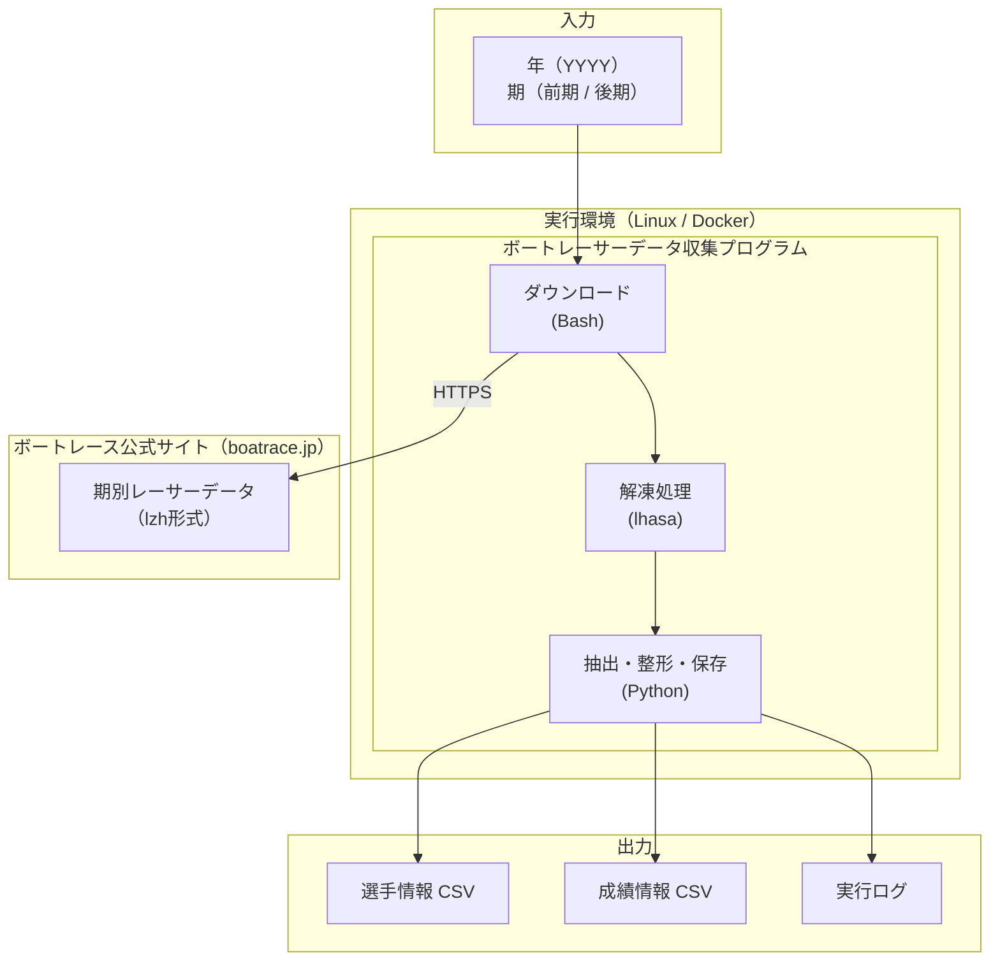
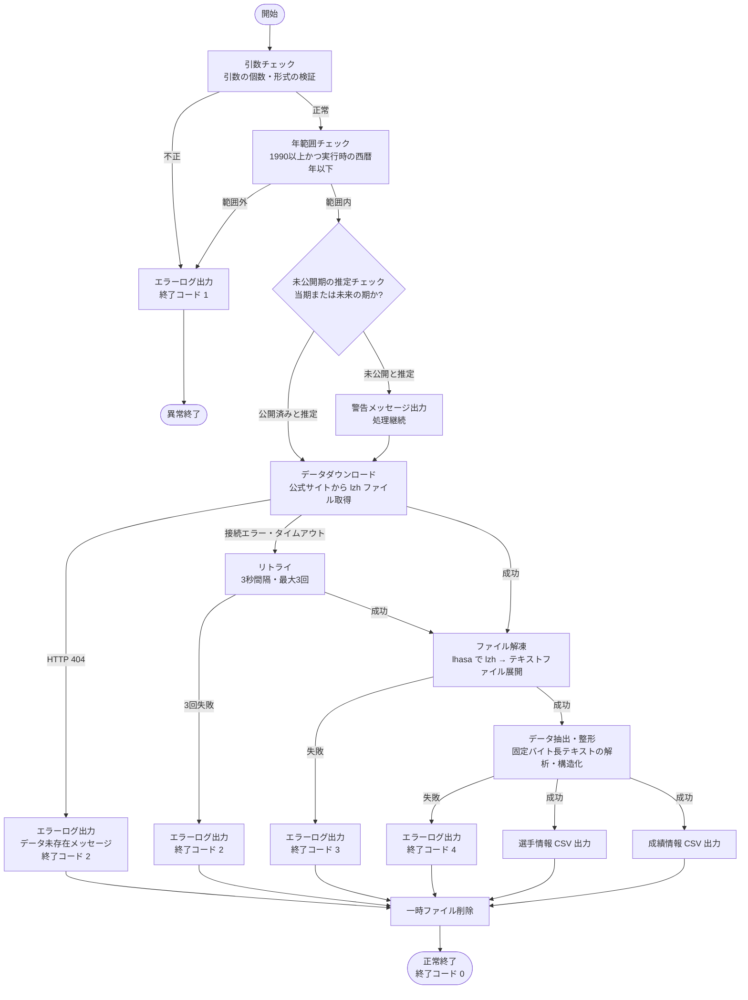

# ボートレーサーデータ収集プログラム 要求仕様書

| 項目 | 内容 |
|------|------|
| ドキュメントID | collect_racer_data_SRS |
| バージョン | 1.0 |
| 作成日 | 2026-05-01 |
| ステータス | ドラフト |
| 参照元 | collect_racer_data_RPF.md |

---

## 目次

1. [目的・背景](#1-目的背景)
2. [システム概要](#2-システム概要)
3. [用語定義](#3-用語定義)
4. [機能要件](#4-機能要件)
5. [非機能要件](#5-非機能要件)
6. [外部インターフェース仕様](#6-外部インターフェース仕様)
7. [データ要件](#7-データ要件)
8. [制約事項](#8-制約事項)
9. [前提条件](#9-前提条件)
10. [受入基準](#10-受入基準)

---

## 1. 目的・背景

### 1.1 目的

公式サイトからボートレーサーの選手情報および成績情報を自動で収集し、データ分析ツールで直接利用可能な形式に変換・保存するプログラムを提供する。

### 1.2 背景

ボートレースの公式サイトでは、期別のレーサーデータをlzh形式の圧縮ファイルとして公開している。現状、以下の課題がある。

- データ取得・解凍・整形の各工程をすべて手動で行う必要がある
- 提供フォーマットが固定バイト長テキストであり、そのままでは分析ツールで扱えない
- 定期的なデータ更新が困難であり、最新データの維持にコストがかかる

### 1.3 スコープ

**対象**

- 公式サイトからの期別レーサーデータの自動ダウンロード
- lzh形式ファイルの自動解凍
- 固定バイト長テキストからの選手情報・成績情報の抽出および整形
- 分析可能な形式（CSV）でのデータ保存
- コマンドラインからの手動実行およびスケジューラによる自動実行

**対象外**

- 収集データの分析・可視化・レポート生成
- WebアプリケーションやダッシュボードなどのUI
- 公式サイト以外のデータソースからのデータ収集
- リアルタイムデータの収集（レース中継・オッズ等）

---

## 2. システム概要

### 2.1 システム構成



### 2.2 処理フロー



---

## 3. 用語定義

| 用語 | 定義 |
|------|------|
| 期 | ボートレーサーの成績集計期間。5月1日〜10月31日を「前期」、11月1日〜翌年4月30日を「後期」とする |
| 選手情報 | レーサーの個人属性情報（登録番号・氏名・支部・出身地・生年月日・体重・級別等） |
| 成績情報 | レーサーの期別競技成績（出走数・勝率・連対率・事故点等） |
| 固定バイト長テキスト | 各フィールドが決められたバイト数で区切られたテキスト形式のデータ |
| lzh | 公式サイトで使用されている圧縮形式 |
| lhasa | lzh形式の解凍ツール |
| F | フライング。スタートで指定時刻より早く発進したことによる失格 |
| L0 | 落水（転覆なし）。レース中に選手がボートから落水したが転覆しなかった事故 |
| L1 | 落水（転覆あり）。レース中にボートが転覆した事故 |
| K0 | 機械故障（コース上）。レース中にコース上でエンジン等が故障し走行不能になった事故 |
| K1 | 機械故障（コース外）。コース外でエンジン等が故障し出走できなかった事故 |
| S0 | 不出走。レース当日に出走できなかった場合 |
| S1 | 不出走（事前）。レース前日までに出走取消が確定した場合 |
| S2 | 不出走（その他）。上記以外の理由による不出走 |
| 複勝率 | レースで2着以内（1コース〜2コース進入時）または3着以内に入った割合。公式データでは「2連率」に相当 |
| 能力指数 | レーサーの総合的な競走能力を数値化した指標。今期・前期の値が公式データに収録される |
| 優出 | 優勝戦（決勝レース）に出場すること。優出回数はその集計期間内の優勝戦出場回数を指す |
| 養成期 | レーサー養成所を卒業した期番号。同期のレーサーを識別するために使用する |

---

## 4. 機能要件

### 4.1 入力パラメータ受付

| 要件ID | 内容 |
|--------|------|
| F-01 | 年（西暦4桁）と期（前期 / 後期）をコマンドライン引数として受け付けること |
| F-02 | 年は西暦4桁（例：2025）で指定できること |
| F-03 | 期は `1`（前期）または `2`（後期）の数値のみで指定できること |
| F-04 | 引数が不正な場合は処理を中断し、使用方法をエラーメッセージとして出力すること |
| F-05 | 年は1990以上かつ実行時の西暦年以下の範囲であること。範囲外の場合は処理を中断しエラーメッセージを出力すること |
| F-06 | 実行時点でデータが未公開と推定される年・期を指定した場合は、その旨を警告メッセージとして出力した上で処理を継続し、ダウンロード失敗時は終了コード 2 で終了すること。未公開と推定する条件は「指定年が実行時の西暦年と一致し、かつ指定期の終了月（前期=10月、後期=翌年4月）が実行時の月より未来である場合」とする |

### 4.2 データダウンロード

| 要件ID | 内容 |
|--------|------|
| F-07 | 指定された年・期に対応するlzhファイルを公式サイトから自動ダウンロードすること |
| F-08 | ダウンロードはHTTPS通信で行うこと |
| F-09 | HTTPエラー（4xx / 5xx）が返された場合は処理を中断し、ステータスコードをエラーログに出力すること |
| F-10 | ダウンロードしたファイルは一時領域に保存すること |
| F-11 | HTTP 404が返された場合は「指定した年・期のデータは公式サイトに存在しません」というメッセージをエラーログに出力し、終了コード 2 で終了すること |
| F-12 | 接続エラー・タイムアウト発生時は3秒間隔で最大3回までリトライすること。3回すべて失敗した場合は終了コード 2 で終了すること |

### 4.3 ファイル解凍

| 要件ID | 内容 |
|--------|------|
| F-13 | ダウンロードしたlzhファイルをlhasaで解凍すること |
| F-14 | 解凍後のテキストファイルを一時領域に展開すること |
| F-15 | 解凍失敗時は処理を中断し、エラーログを出力すること |

### 4.4 データ抽出・整形

| 要件ID | 内容 |
|--------|------|
| F-16 | 解凍されたテキストファイルから固定バイト長レイアウトに従い各フィールドを抽出すること |
| F-17 | 抽出対象の選手情報フィールドは [7.2 選手情報スキーマ](#72-選手情報スキーマ) に定義する項目とすること |
| F-18 | 抽出対象の成績情報フィールドは [7.3 成績情報スキーマ](#73-成績情報スキーマ) に定義する項目とすること |
| F-19 | 文字コードはShift-JIS（CP932）として読み込み、UTF-8に変換して保存すること |
| F-20 | 数値フィールドは適切な数値型（整数・浮動小数点数）に変換して保存すること |
| F-21 | データ抽出失敗時（レイアウト不一致等）は該当行をスキップしエラーログに記録すること |

### 4.5 データ保存

| 要件ID | 内容 |
|--------|------|
| F-22 | 整形した選手情報をCSVファイルとして保存すること |
| F-23 | 整形した成績情報をCSVファイルとして保存すること |
| F-24 | CSVファイルはUTF-8（BOM付き）で保存し、Excelで直接開けること |
| F-25 | 出力先ディレクトリが存在しない場合は自動的に作成すること |
| F-26 | 同一年・期のファイルが既に存在する場合は上書きすること |
| F-27 | 保存先パスは [6.3 ファイルシステム仕様](#63-ファイルシステム仕様) に従うこと |

### 4.6 後処理

| 要件ID | 内容 |
|--------|------|
| F-28 | 処理完了後、ダウンロードしたlzhファイルおよび解凍した一時ファイルを削除すること |
| F-29 | エラーで処理が中断した場合も一時ファイルは削除すること |

### 4.7 ログ出力

| 要件ID | 内容 |
|--------|------|
| F-30 | 各処理ステップの開始・終了をINFOレベルでログ出力すること |
| F-31 | エラー発生時はERRORレベルで原因・発生箇所・パラメータをログ出力すること |
| F-32 | ログはファイルと標準エラー出力の両方に出力すること |
| F-33 | ログファイルには日時・ログレベル・メッセージを含めること |

---

## 5. 非機能要件

### 5.1 実装言語

| 要件ID | 内容 |
|--------|------|
| NF-01 | データダウンロードおよびファイル解凍処理はBashシェルスクリプトで実装すること |
| NF-02 | データ抽出・整形・保存処理はPython 3.12で実装すること |
| NF-03 | Pythonのデータ処理にはpandasライブラリを使用すること |

### 5.2 エラーハンドリング

| 要件ID | 内容 |
|--------|------|
| NF-04 | ネットワークエラー・ファイルIOエラー・パースエラーのそれぞれを個別に捕捉し、適切なエラーメッセージを出力すること |
| NF-05 | プログラムが異常終了する場合は非ゼロの終了コードを返すこと |
| NF-06 | 正常終了時は終了コード 0 を返すこと |

### 5.3 保守性

| 要件ID | 内容 |
|--------|------|
| NF-07 | データレイアウト（フィールド定義・バイト位置）は設定ファイルまたはコード上の1箇所に集約し、変更時の修正箇所を最小化すること |
| NF-08 | ダウンロードURLは設定として外部から変更可能な構造にすること |

### 5.4 可読性

| 要件ID | 内容 |
|--------|------|
| NF-09 | 関数・変数・ファイル名はその目的が分かる命名とすること |
| NF-10 | 非自明な処理には処理の意図を説明するコメントを付与すること |

### 5.5 実行性能

| 要件ID | 内容 |
|--------|------|
| NF-11 | 1回の実行（1年・1期分）は通常のネットワーク環境下で10分以内に完了すること |

---

## 6. 外部インターフェース仕様

### 6.1 CLIインターフェース

```
使用方法:
  ./collect_racer_data.sh <year> <term>

引数:
  year  : 収集対象の西暦年（4桁整数、例: 2025）
  term  : 収集対象の期（1=前期, 2=後期）

例:
  ./collect_racer_data.sh 2025 1   # 2025年前期のデータを収集
  ./collect_racer_data.sh 2024 2   # 2024年後期のデータを収集

終了コード:
  0 : 正常終了
  1 : 引数エラー
  2 : ダウンロードエラー
  3 : 解凍エラー
  4 : データ処理エラー
```

### 6.2 公式サイト連携

| 項目 | 内容 |
|------|------|
| 通信方式 | HTTPS（GET） |
| データ形式 | lzh形式圧縮ファイル |
| 文字コード（ダウンロード元） | Shift-JIS（CP932） |

**ダウンロードURL形式**

```
https://www.boatrace.jp/static_extra/pc_static/download/data/kibetsu/fan{YY}{MM}.lzh
```

ファイル名の `{YY}` と `{MM}` は、指定年・期から以下のルールで導出する。

| 期 | `{YY}`（西暦下2桁） | `{MM}` |
|----|---------------------|--------|
| 前期（1） | 指定年 − 1 の下2桁 | `10` |
| 後期（2） | 指定年の下2桁 | `04` |

**具体例**

| 指定 | ダウンロードURL |
|------|----------------|
| 2025年 前期 | `https://www.boatrace.jp/static_extra/pc_static/download/data/kibetsu/fan2410.lzh` |
| 2025年 後期 | `https://www.boatrace.jp/static_extra/pc_static/download/data/kibetsu/fan2504.lzh` |
| 2024年 前期 | `https://www.boatrace.jp/static_extra/pc_static/download/data/kibetsu/fan2310.lzh` |
| 2024年 後期 | `https://www.boatrace.jp/static_extra/pc_static/download/data/kibetsu/fan2404.lzh` |

### 6.3 ファイルシステム仕様

```
<プロジェクトルート>/
├── collect_racer_data.sh            # エントリーポイント（Bashスクリプト）
├── src/
│   └── process_racer_data.py   # データ抽出・整形・保存（Pythonスクリプト）
├── data/
│   └── <year>_<term>/          # 出力ディレクトリ（例: 2025_1）
│       ├── racer_info.csv      # 選手情報
│       └── racer_results.csv   # 成績情報
├── logs/
│   └── collect_<datetime>.log  # 実行ログ
└── tmp/                        # 一時ファイル領域（実行後に削除）
```

### 6.4 内部インターフェース仕様

`collect_racer_data.sh` から `process_racer_data.py` を以下の形式で呼び出す。

```
python src/process_racer_data.py <input_file> <year> <term> <output_dir>
```

| 引数 | 内容 |
|------|------|
| `input_file` | 解凍後のテキストファイルのパス。lhasaは `fan{YY}{MM}.lzh` を解凍すると同名の `fan{YY}{MM}.txt` を生成する（例: `fan2404.lzh` → `tmp/fan2404.txt`） |
| `year` | 収集対象の西暦年（4桁整数） |
| `term` | 収集対象の期（1=前期, 2=後期） |
| `output_dir` | CSVの出力先ディレクトリパス（例: `data/2024_2`） |

**呼び出し例（2024年後期の場合）**

```
python src/process_racer_data.py tmp/fan2404.txt 2024 2 data/2024_2
```

**終了コード**

| コード | 意味 |
|--------|------|
| 0 | 正常終了 |
| 4 | データ処理エラー（パース失敗・ファイルIOエラー等） |

`collect_racer_data.sh` は `process_racer_data.py` の終了コードを受け取り、非ゼロの場合は終了コード 4 で異常終了すること。

---

## 7. データ要件

### 7.1 入力データ

公式サイト（`https://www.boatrace.jp/owpc/pc/extra/data/download.html`）から提供される期別レーサーデータ（lzh形式）。ファイルレイアウトは公式のデータレイアウト仕様（`https://www.boatrace.jp/owpc/pc/extra/data/layout.html`）に従う。

### 7.2 選手情報スキーマ

公式データレイアウトの個人属性・期別属性に相当するフィールドを収録する。

| フィールド名（CSV列名） | 型 | 元バイト数 | 内容 |
|------------------------|-----|-----------|------|
| racer_id | 整数 | 4 | 選手登録番号 |
| year | 整数 | 4 | 対象年 |
| period | 整数 | 1 | 対象期（1=前期, 2=後期） |
| name | 文字列 | 16 | 氏名（漢字） |
| name_kana | 文字列 | 15 | 氏名（フリガナ） |
| branch | 文字列 | 4 | 所属支部（現住所、2014年後期以降） |
| birthplace | 文字列 | 6 | 出身地（2014年後期以降、末尾追加） |
| birthdate | 日付（YYYY-MM-DD） | 7 | 生年月日（年号1桁＋YYMMDD6桁をYYYY-MM-DDに変換。変換ルールは下表参照） |
| gender | 整数 | 1 | 性別（1=男, 2=女） |
| age | 整数 | 2 | 年齢（才） |
| height | 浮動小数点数 | 3 | 身長（cm） |
| weight | 浮動小数点数 | 2 | 体重（kg） |
| blood_type | 文字列 | 2 | 血液型（A / B / AB / O） |
| training_term | 整数 | 3 | 養成期 |
| grade | 文字列 | 2 | 現期級別（A1 / A2 / B1 / B2） |
| prev_grade | 文字列 | 2 | 前期級別 |
| prev2_grade | 文字列 | 2 | 前々期級別 |
| prev3_grade | 文字列 | 2 | 前々々期級別 |
| current_ability_index | 浮動小数点数 | 4 | 今期能力指数（小数点以下2桁） |
| prev_ability_index | 浮動小数点数 | 4 | 前期能力指数（小数点以下2桁） |
| calc_period_from | 日付（YYYY-MM-DD） | 8 | 成績算出期間（自）（YYYYMMDD→変換） |
| calc_period_to | 日付（YYYY-MM-DD） | 8 | 成績算出期間（至）（YYYYMMDD→変換） |

**年号変換ルール**

| 年号コード | 元号 | 西暦開始年 | 西暦終了年 | 変換式（西暦年） |
|-----------|------|-----------|-----------|----------------|
| `S` | 昭和 | 1926 | 1989 | YY + 1925 |
| `H` | 平成 | 1989 | 2019 | YY + 1988 |
| `R` | 令和 | 2019 | — | YY + 2018 |

例: `S441111` → 昭和44年11月11日 → `1969-11-11`

### 7.3 成績情報スキーマ

公式データレイアウトの総合成績・コース別成績に相当するフィールドを収録する。

#### 総合成績

| フィールド名（CSV列名） | 型 | 元バイト数 | 内容 |
|------------------------|-----|-----------|------|
| racer_id | 整数 | 4 | 選手登録番号 |
| year | 整数 | 4 | 対象年 |
| period | 整数 | 1 | 対象期（1=前期, 2=後期） |
| race_count | 整数 | 3 | 出走回数 |
| first_count | 整数 | 3 | 1着回数 |
| second_count | 整数 | 3 | 2着回数 |
| finalist_count | 整数 | 2 | 優出回数 |
| championship_count | 整数 | 2 | 優勝回数 |
| win_rate | 浮動小数点数 | 4 | 勝率（小数点以下2桁） |
| place_rate | 浮動小数点数 | 4 | 複勝率（小数点以下1桁） |
| avg_start_time | 浮動小数点数 | 3 | 平均スタートタイミング（秒、小数点以下2桁） |

#### コース別成績（1〜6コース）

以下のフィールドをコースごとに収録する（`N` はコース番号 1〜6）。上表の `N` を実際のコース番号に置き換えた列名がCSVに出力される（例: `course_1_entry_count`〜`course_6_entry_count`）。

| フィールド名（CSV列名） | 型 | 元バイト数 | 内容 |
|------------------------|-----|-----------|------|
| course_N_entry_count | 整数 | 3 | Nコース進入回数 |
| course_N_place_rate | 浮動小数点数 | 4 | Nコース複勝率（小数点以下1桁） |
| course_N_avg_start_time | 浮動小数点数 | 3 | Nコース平均スタートタイミング（秒、小数点以下2桁） |
| course_N_avg_start_order | 浮動小数点数 | 3 | Nコース平均スタート順位（小数点以下2桁） |
| course_N_1st_count | 整数 | 3 | Nコース1着回数 |
| course_N_2nd_count | 整数 | 3 | Nコース2着回数 |
| course_N_3rd_count | 整数 | 3 | Nコース3着回数 |
| course_N_4th_count | 整数 | 3 | Nコース4着回数 |
| course_N_5th_count | 整数 | 3 | Nコース5着回数 |
| course_N_6th_count | 整数 | 3 | Nコース6着回数 |
| course_N_F_count | 整数 | 2 | NコースF（フライング）回数 |
| course_N_L0_count | 整数 | 2 | NコースL0（落水・転覆なし）回数 |
| course_N_L1_count | 整数 | 2 | NコースL1（落水・転覆あり）回数 |
| course_N_K0_count | 整数 | 2 | NコースK0（機械故障・コース上）回数 |
| course_N_K1_count | 整数 | 2 | NコースK1（機械故障・コース外）回数 |
| course_N_S0_count | 整数 | 2 | NコースS0（不出走）回数 |
| course_N_S1_count | 整数 | 2 | NコースS1（不出走・事前）回数 |
| course_N_S2_count | 整数 | 2 | NコースS2（不出走・その他）回数 |

**展開後の列名一覧（1コースの例）**

```
course_1_entry_count, course_1_place_rate, course_1_avg_start_time, course_1_avg_start_order,
course_1_1st_count, course_1_2nd_count, course_1_3rd_count, course_1_4th_count,
course_1_5th_count, course_1_6th_count,
course_1_F_count, course_1_L0_count, course_1_L1_count,
course_1_K0_count, course_1_K1_count,
course_1_S0_count, course_1_S1_count, course_1_S2_count
```

2〜6コースも同じパターンで続く（合計 18項目 × 6コース = 108列）。

#### コースなし脱落

| フィールド名（CSV列名） | 型 | 元バイト数 | 内容 |
|------------------------|-----|-----------|------|
| no_course_L0_count | 整数 | 2 | L0（落水・転覆なし）回数 |
| no_course_L1_count | 整数 | 2 | L1（落水・転覆あり）回数 |
| no_course_K0_count | 整数 | 2 | K0（機械故障・コース上）回数 |
| no_course_K1_count | 整数 | 2 | K1（機械故障・コース外）回数 |

> **注記**: 公式データレイアウト仕様（`https://www.boatrace.jp/owpc/pc/extra/data/layout.html`）にモーター番号・ボート番号の記載はなかったため、旧スキーマのそれらフィールドは削除した。元バイト数は実装時のパース処理の参考値であり、正確な開始位置は公式仕様を参照すること。

### 7.4 出力CSVフォーマット

| 項目 | 内容 |
|------|------|
| ファイル形式 | CSV（カンマ区切り） |
| 文字コード | UTF-8（BOM付き） |
| ヘッダ行 | 1行目にフィールド名を出力する |
| 改行コード | CRLF（Windowsとの互換性を確保） |
| 数値の欠損値 | 空文字列（`""`）で表現する |
| 文字列の欠損値 | 空文字列（`""`）で表現する |

---

## 8. 制約事項

| 制約ID | 内容 |
|--------|------|
| C-01 | 実行環境はLinux（Debian系）であり、BashおよびPython 3.12が使用可能であること |
| C-02 | lzh形式の解凍にlhasaを使用すること（実行環境にインストール済みであること） |
| C-03 | 実行環境からインターネット経由で公式サイトへHTTPS接続できること |
| C-04 | 収集対象は公式サイトで公開されているデータのみとし、認証が必要なデータや非公開情報の取得は対象外とする |
| C-05 | Pythonの依存ライブラリはpandasおよびnumpyのみとする |

---

## 9. 前提条件

本仕様書は以下の前提条件が成立することを前提として作成している。前提条件が崩れた場合は仕様の見直しが必要になる。

| 前提ID | 内容 |
|--------|------|
| P-01 | 公式サイトのデータ提供URLは変更されないこと |
| P-02 | 公式サイトのファイル形式（lzh）は変更されないこと |
| P-03 | 公式サイトの固定バイト長レイアウトは変更されないこと |

---

## 10. 受入基準

| 基準ID | 検証方法 | 合格条件 |
|--------|----------|----------|
| AC-01 | 任意の年・期を引数に指定してプログラムを実行する | 対応するデータが公式サイトから自動取得され、CSVが出力されること |
| AC-02 | 出力されたCSVをpandasの `read_csv()` で読み込む | エラーなく読み込めること |
| AC-03 | 出力されたCSVをExcelで開く | 文字化けなく開けること |
| AC-04 | 出力された選手情報CSVの内容を確認する | 選手情報スキーマの全フィールドが欠損なく含まれること |
| AC-05 | 出力された成績情報CSVの内容を確認する | 成績情報スキーマの全フィールドが欠損なく含まれること |
| AC-06 | 不正な引数（例：`2025 3`、`abcd 1`）でプログラムを実行する | エラーメッセージが表示され、終了コード 1 で終了すること |
| AC-07 | 公式サイトへの接続を遮断した状態でプログラムを実行する | エラーログが出力され、非ゼロの終了コードで終了すること |
| AC-08 | プログラムが異常終了した後に一時ファイルを確認する | `tmp/` 以下に残存ファイルがないこと |
| AC-09 | cronに登録してスケジューラから実行する | 無人実行が成功し、CSVが出力されること |
| AC-10 | 1年・1期分のデータ収集の実行時間を計測する | 通常のネットワーク環境下で10分以内に完了すること |
| AC-11 | 出力された選手情報・成績情報CSVの任意の選手を公式サイトの掲載値と照合する | 登録番号・氏名・勝率・出走回数等の値が公式掲載値と一致すること |
| AC-12 | 正常実行後に `logs/` ディレクトリを確認する | `collect_<datetime>.log` が生成され、各処理ステップのINFOログが記録されていること |
| AC-13 | 同一年・期を指定して2回連続でプログラムを実行する | 2回目実行後のCSVが最新の実行結果で上書きされ、重複行が存在しないこと |
| AC-14 | 範囲外の年（例: `1989 1`、`実行年+1 1`）を引数に指定してプログラムを実行する | エラーメッセージが表示され、終了コード 1 で終了すること |
| AC-15 | 現在進行中または未来の年・期を引数に指定してプログラムを実行する | 警告メッセージが標準エラー出力およびログに出力され、その後ダウンロード処理が継続されること |
| AC-16 | ネットワークを遮断した状態で接続エラーが発生するよう設定してプログラムを実行する | 3秒間隔で最大3回リトライが行われ、3回失敗後に終了コード 2 で終了すること |

---

## 改版履歴

| バージョン | 日付 | 変更内容 | 変更者 |
|-----------|------|----------|--------|
| 1.0 | 2026-05-01 | 初版作成（collect_racer_data_RPF.md を基に作成） | — |
